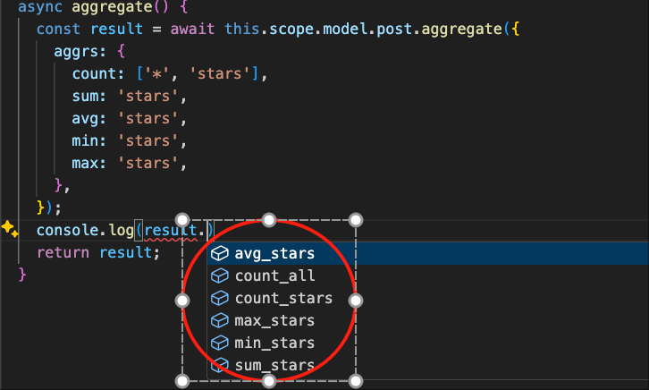

# 聚合与分组

下面以模块`test-vona`为例，讲解`聚合与分组`的用法

## count

``` typescript
class ServicePost {
  async count() {
    return await this.scope.model.post.count();
  }
}  
```

* 参数：Params

|名称|描述|
|--|--|
|column|需要count的字段|
|distinct|是否启用distinct|
|where|条件语句|
|joins|关联表|

## 聚合

``` typescript
class ServicePost {
  async aggregate() {
    const result = await this.scope.model.post.aggregate({
      aggrs: {
        count: ['*', 'stars'],
        sum: 'stars',
        avg: 'stars',
        min: 'stars',
        max: 'stars',
      },
    });
    return result;
  }
}  
```

Vona ORM 自动从参数`aggrs`推断出`result`的类型



* 参数：Params

|名称|描述|
|--|--|
|aggrs|需要聚合的函数和字段。函数：`count`/`sum`/`avg`/`min`/`max`。字段：`string`/`string[]` |
|distinct|是否启用distinct|
|where|条件语句|
|joins|关联表|

## 分组

``` typescript
```