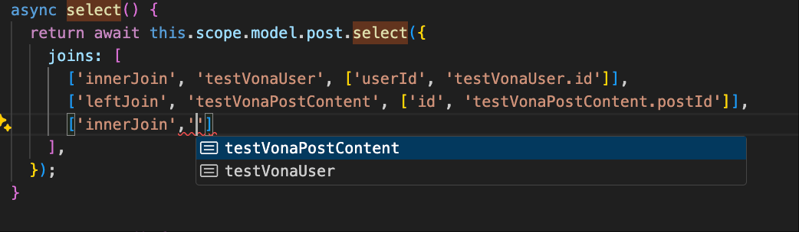
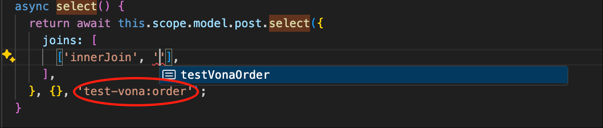
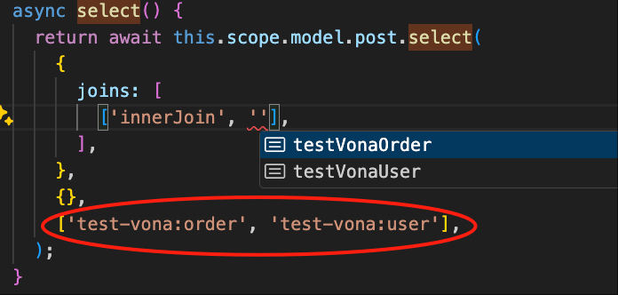

# CRUD(Select)

下面以模块`test-vona`为例，讲解 CRUD 中 Select 的用法

## Select基本操作

模块`test-vona`中定义了 Model`Post`，可以这样查询`Post`的数据

### 1. select

``` typescript
class ServicePost {
  async select() {
    return await this.scope.model.post.select();
  }
}
```

### 2. get

``` typescript
class ServicePost {
  async get(id: TableIdentity) {
    return await this.scope.model.post.get({ id });
  }
}
```

### 3. count

``` typescript
class ServicePost {
  async count() {
    return await this.scope.model.post.count();
  }
}
```

## Select类型定义

``` typescript
async select<
  T extends IModelSelectParams<TRecord>,
  ModelJoins extends TypeModelsClassLikeGeneral | undefined,
>(
  params?: T,
  options?: IModelMethodOptions,
  _modelJoins?: ModelJoins,
): Promise<any[]>;
```

* 举例：一个相对复杂的 select 查询：

``` typescript
class ServicePost {
  async select() {
    return await this.scope.model.post.select({
      columns: ['id', 'title', 'userId'],
      where: {
        'id': { _gt_: 1 },
        'testVonaUser.id': 1,
      },
      joins: [['innerJoin', 'testVonaUser', ['userId', 'testVonaUser.id']]],
      offset: 0,
      limit: 20,
      orders: [['createdAt', 'desc']],
    }, {
      disableDeleted: false,
    }, 'test-vona:user');
  }
}
```

## Select参数：Options

|名称|类型|默认值|描述|
|--|--|--|--|
|disableDeleted|boolean|false|是否禁止软删除|
|disableCreateTime|boolean|false|是否禁止自动设置创建时间|
|disableUpdateTime|boolean|false|是否禁止自动设置更新时间|
|disableCacheQuery|boolean|false|是否禁用`Cache Query`|
|disableCacheEntity|boolean|false|是否禁用`Cache Entity`|
|iid|number|undefined|可以显式设置`实例Id`|
|deleted|boolean|undefined|可以显式设置`deleted`值|

## Select参数：Params

|名称|描述|
|--|--|
|distinct|是否启用distinct|
|columns|需要查询的字段列表|
|where|条件语句|
|joins|关联表|
|orders|排序|
|limit|可用于分页查询|
|offset|可用于分页查询|
|include|静态关系|
|with|动态关系|

### 1. orders

是数组类型，可以指定多个 orders：

``` typescript
async select() {
  return await this.scope.model.post.select({
    orders: [
      ['createdAt', 'desc'],
      ['title', 'asc'],
    ],
  });
}
```

### 2. joins

可以通过`joins`关联多个数据表

``` typescript
async select() {
  return await this.scope.model.post.select({
    joins: [
      ['innerJoin', 'testVonaUser', ['userId', 'testVonaUser.id']],
      ['leftJoin', 'testVonaPostContent', ['id', 'testVonaPostContent.postId']],
    ],
  });
}
```

`joins`支持类型提示，如图所示：



那么，图中所示的数据表清单来自于哪里呢？

前面提到，可以在`Model`中定义多个`Entity`之间的关系，所以，系统自动从 Model 定义的关系中提取 Entity 对应的数据表。Model`Post`的关系定义如下：

``` typescript
@Model({
  relations: {
    postContent: $relation.hasOne('test-vona:postContent', 'postId', { columns: ['id', 'content'] }),
    user: $relation.belongsTo(ModelPost, () => ModelUser, 'userId', { autoload: true, columns: ['id', 'name'] }),
  },
})
class ModelPost {}
```

在一个大型的业务系统中，Model 可能并不会定义所有的关系。那么，也可以通过参数`_modelJoins`指定需要关联的 Models，系统从这些 Models 中提取对应的数据表

比如，模块`test-vona`中定义了 model`order`。那么，我们可以这样使用`joins`:



也可以指定多个 Models：



## Where