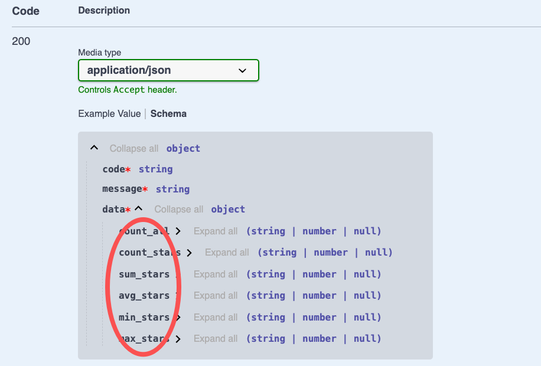

# $Dto.aggregate

`$Dto.aggregate`用于标注聚合操作的返回结果

## 如何使用

### 1. 创建DTO

在 VSCode 中，可以通过右键菜单`Vona Create/Dto`创建 DTO 的代码骨架：

``` typescript
@Dto()
export class DtoPostAggregate {}
```

### 2. 继承$Dto.aggregate

``` diff
@Dto()
export class DtoPostAggregate
+ extends $Dto.aggregate(() => ModelPost, {
+   count: ['*', 'stars'],
+   sum: 'stars',
+   avg: 'stars',
+   min: 'stars',
+   max: 'stars',
+ }) {}
```

## 标注API返回值

以 Controller Post 的 aggregate 方法为例，标注 API 返回值：

``` diff
class ControllerPost {
  @Web.get('aggregate')
+ @Api.body(DtoPostAggregate)
+ async aggregate(): Promise<DtoPostAggregate> {
    return await this.scope.model.post.aggregate({
      aggrs: {
        count: ['*', 'stars'],
        sum: 'stars',
        avg: 'stars',
        min: 'stars',
        max: 'stars',
      },
    });
  }
}
```

- `@Api.body`：传入 DtoPostAggregate，用于标注 API 返回值

基于`DtoPostAggregate`生成的 Swagger/Openapi 效果如下：


