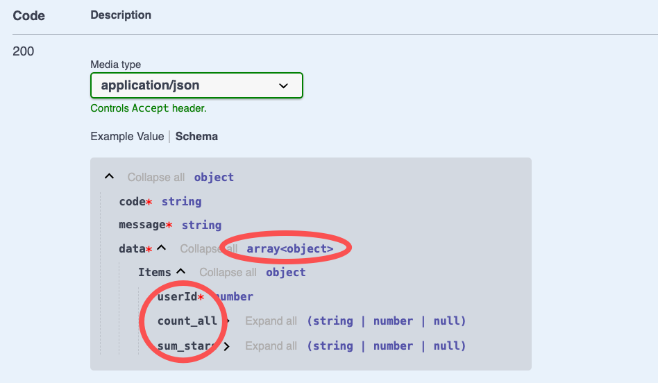

# $Dto.group

`$Dto.group`用于标注分组操作的返回结果

## 如何使用

### 1. 创建DTO

在 VSCode 中，可以通过右键菜单`Vona Create/Dto`创建 DTO 的代码骨架：

``` typescript
@Dto()
export class DtoPostGroup {}
```

### 2. 继承$Dto.group

``` diff
@Dto()
export class DtoPostGroup
+ extends $Dto.group(() => ModelPost, 'userId', {
+   count: '*',
+   sum: 'stars',
+ }) {}
```

## 标注API返回值

以 Controller Post 的 group 方法为例，标注 API 返回值：

``` diff
class ControllerPost {
  @Web.get('group')
+ @Api.body(v.array(DtoPostGroup))
+ async group(): Promise<DtoPostGroup[]> {
    return await this.scope.model.post.group({
      groups: 'userId',
      aggrs: {
        count: '*',
        sum: 'stars',
      },
    });
  }
}
```

- `@Api.body`：传入`v.array(DtoPostGroup)`，用于标注 API 返回值

基于`DtoPostGroup`生成的 Swagger/Openapi 效果如下：


