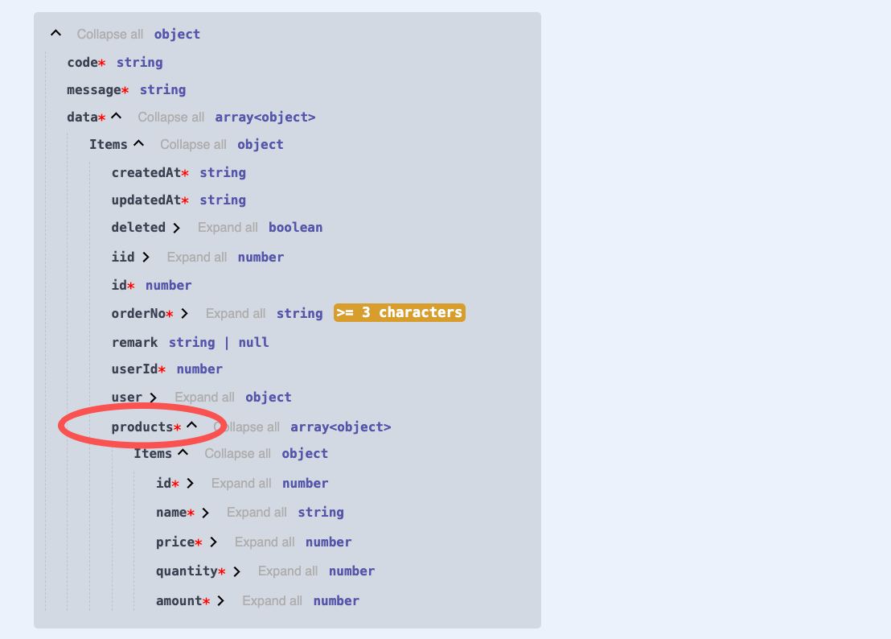

# 介绍

在开发后端 API 服务时，DTO 是进行`参数验证`、`生成Swagger元数据`的关键节点。如果不能像推断类型一样动态推断出 DTO，那么，我们就仍然需要手工创建 DTO。随着业务的增长，复杂的表间关系会让手工补充 DTO 的工作日益繁重

而 Vona ORM 首创 DTO 动态推断与生成能力，解放我们的双手，显著提升生产力。甚至可以说，对于构建更加优雅的 Node.js 后端框架而言，能够动态推断与生成 DTO，是非常重要的`里程碑`

## DTO清单

Vona ORM 提供了以下 DTO：

|名称|说明|
|--|--|
|$Dto.get|标注返回结果|
|$Dto.query/DtoQueryBase|标注Query参数|
|$Dto.queryPage/DtoQueryPageBase|标注带分页的Query参数|
|$Dto.selectAndCount|标注带分页的返回结果|
|$Dto.create|标注Create参数|
|$Dto.update|标注Update参数|
|$Dto.aggregate|标注聚合操作的返回结果|
|$Dto.group|标注分组操作的返回结果|

## DTO使用方法

下面以 Order/Product 为例，演示如何针对`主表-明细表`进行查询操作

## 1. Model关系定义

先在 Model Order 中定义与 Model Product 的`1:n`关系

``` typescript
@Model({
  entity: EntityOrder,
  relations: {
    products: $relation.hasMany(() => ModelProduct, 'orderId', {
      columns: ['id', 'name', 'price', 'quantity', 'amount'],
    }),
  },
})
class ModelOrder {}
```

## 2. 创建Api端点

创建 Controller，提供 findAll 方法

``` typescript
class ControllerOrder {
  @Web.get('findAll')
  async findAll() {
    return this.scope.model.order.select({
      include: {
        products: true,
      },
    });
  }
}
```

## 3. 动态推断与生成DTO

由于此 Api 返回的结果是`主表-明细表`结构，我们不能简单的使用`EntityOrder数组`来标注返回类型。而是使用 DTO 进行动态推断与生成

``` diff
+ import { $Dto } from 'vona-module-a-orm';

class ControllerOrder {
  @Web.get('findAll')
+ @Api.body(v.array($Dto.get(() => ModelOrder, { include: { products: true } })))
  async findAll() {
    return this.scope.model.order.select({
      include: {
        products: true,
      },
    });
  }
}
```

- `@Api.body`：标注返回结果
- `v.array`: 标注数组
- `$Dto.get`: 用于动态推断与生成 DTO

`$Dto.get`生成的 DTO 是`主表-明细表`结构，其 Swagger/Openapi 效果如下：



## 4. 封装DTO

我们还可以创建一个新的 DTO class，将前面的`$Dto.get`动态推断代码封装起来，从而用于其他地方

1. 在 VSCode 中，可以通过右键菜单`Vona Create/Dto`创建 DTO 的代码骨架：

``` typescript
@Dto()
export class DtoOrderResult {}
```

2. 使用继承机制来封装 DTO：

``` diff
+ import { $Dto } from 'vona-module-a-orm';

@Dto()
export class DtoOrderResult
+ extends $Dto.get(() => ModelOrder, { include: { products: true } }) {}
```

3. 现在，我们再使用`DtoOrderResult`重构前面的 API 代码：

``` diff
class ControllerOrder {
  @Web.get('findAll')
+ @Api.body(v.array(DtoOrderResult))
+ async findAll(): Promise<DtoOrderResult[]> {
    return this.scope.model.order.select({
      include: {
        products: true,
      },
    });
  }
}
```

- 行 3: 直接使用`v.array(DtoOrderResult)`标注类型
- 行 4: 方法返回类型为`Promise<DtoOrderResult[]>`