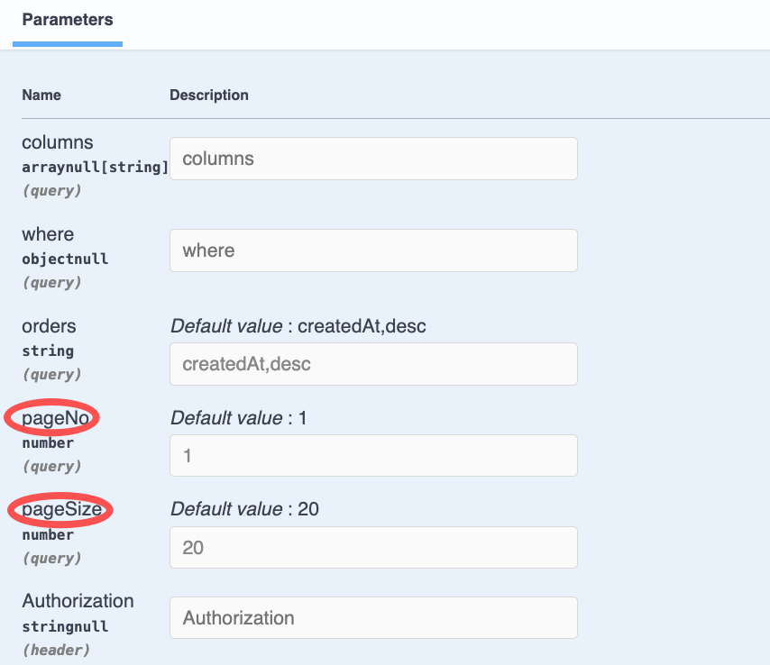
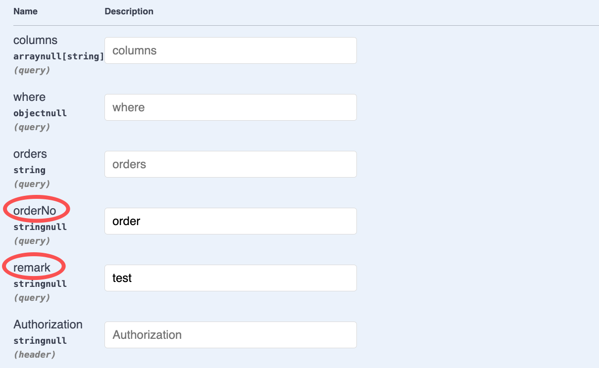

# $Dto.queryPage/DtoQueryPageBase

`$Dto.queryPage/DtoQueryPageBase`用于标注带分页的 Query 参数

## DtoQueryPageBase的用法

`DtoQueryPageBase`继承自`DtoQueryBase`，提供了与分页相关的 Query 参数：`pageNo`, `pageSize`

### 1. 创建DTO

在 VSCode 中，可以通过右键菜单`Vona Create/Dto`创建 DTO 的代码骨架：

``` typescript
@Dto()
export class DtoOrderQueryPage {}
```

### 2. 继承DtoQueryPageBase

``` typescript
@Dto()
export class DtoOrderQueryPage extends DtoQueryPageBase {}
```

## DtoQueryPageBase成员字段

由于`DtoOrderQueryPage`继承自`DtoQueryPageBase`，因此，有以下成员字段：

|名称|说明|举例|
|--|--|--|
|columns|要查询的字段清单|`*`, `id,orderNo,remark`, `["id","orderNo","remark"]`|
|where|条件语句|`{ "orderNo": { "_include_":  "order001" } }`|
|orders|排序|`orderNo,desc`, `[["orderNo", "desc"], ["createdAt", "desc"]]`|
|pageNo|页码|默认值：`1`|
|pageSize|每页条数|默认值：`20`|

## 标注Query参数

以 Controller Order 的 findMany 方法为例，标注 Query 参数：

``` diff
+ import type { IQueryParams } from 'vona-module-a-orm';
+ import { Arg } from 'vona-module-a-web';

class ControllerOrder extends BeanBase {
  @Web.get('findMany')
  @Api.body(DtoOrderResultPage)
  async findMany(
+   @Arg.queryPro(DtoOrderQueryPage) params: IQueryParams<ModelOrder>,
  ): Promise<DtoOrderResultPage> {
    return this.scope.model.order.selectAndCount(params);
  }
}
```

- `@Arg.queryPro`：此 Pipe 对 Query 参数进行 transform，需要传入参数`DtoOrderQueryPage`
- `IQueryParams`: Pipe 对 Query 参数进行 transform 后的数据类型为`IQueryParams`，需要传入泛型参数`ModelOrder`，从而与`model.order.selectAndCount`方法的参数类型相匹配

基于`DtoOrderQueryPage`生成的 Swagger/Openapi 效果如下：



## $Dto.queryPage

如果需要在 DTO 中添加业务字段的查询条件，可以使用`$Dto.queryPage`

``` diff
@Dto()
export class DtoOrderQueryPage
+ extends $Dto.queryPage(EntityOrder, ['orderNo', 'remark']) {}
```

- `$Dto.queryPage`：自动从`EntityOrder`中提取字段`orderNo/remark`，然后与`DtoQueryPageBase`成员字段进行合并

基于`DtoOrderQueryPage`生成的 Swagger/Openapi 效果如下：



## pageSize配置

### 1. App Config

pageSize 默认值为`20`，可以修改 App Config 配置：

`src/backend/config/config/config.dev.ts`

``` typescript
// modules
config.modules = {
  'a-orm': {
    rest: {
      query: {
        pageSize: {
          default: 50,
          max: 200,
        },
      },
    },
  },
};
```

|名称|说明|
|--|--|
|default|默认值|
|max|最大值|

### 2. 业务配置

也可以针对具体的业务，为 Query 参数提供不同的 pageSize 配置：

``` diff
@Dto({
+ fields: {
+   pageSize: z.number().min(1).max(300).default(30),
+ },
})
export class DtoOrderQueryPage extends $Dto.queryPage(EntityOrder, ['orderNo', 'remark']) {}
```
