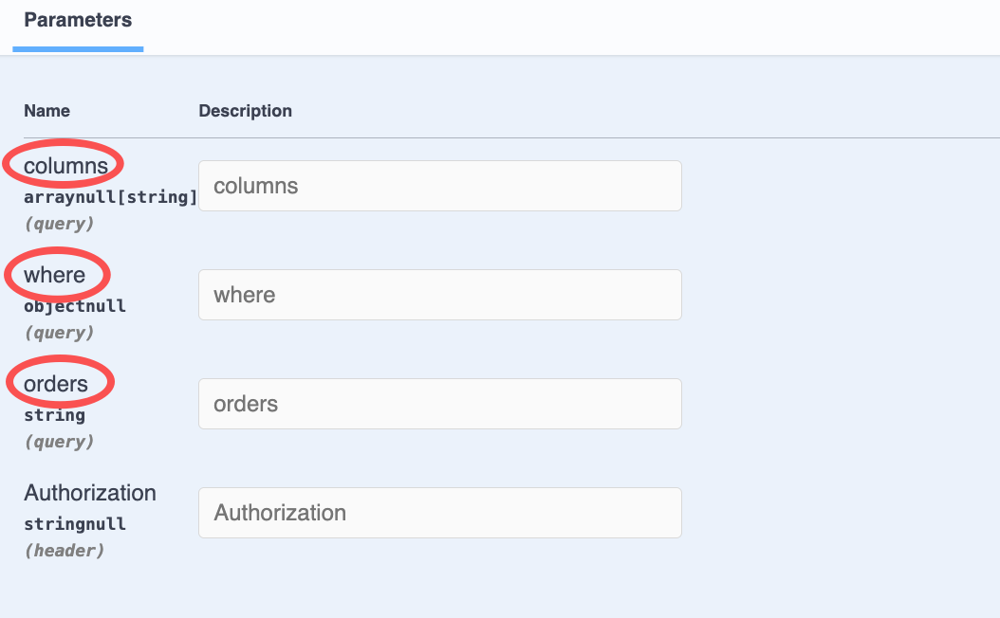

# $Dto.queryPage/DtoQueryPageBase

`$Dto.queryPage/DtoQueryPageBase`用于标注带分页的 Query 参数

## DtoQueryPageBase的用法

`DtoQueryPageBase`继承自`DtoQueryBase`，提供了与分页相关的 Query 参数：`pageNo`, `pageSize`

### 1. 创建DTO

在 VSCode 中，可以通过右键菜单`Vona Create/Dto`创建 DTO 的代码骨架：

``` typescript
@Dto()
export class DtoOrderQueryPage {}
```

### 2. 继承DtoQueryPageBase

``` typescript
@Dto()
export class DtoOrderQueryPage extends DtoQueryPageBase {}
```

## DtoQueryPageBase成员字段

由于`DtoOrderQueryPage`继承自`DtoQueryPageBase`，因此，有以下成员字段：

|名称|说明|举例|
|--|--|--|
|columns|要查询的字段清单|`*`, `id,orderNo,remark`, `["id","orderNo","remark"]`|
|where|条件语句|`{ "orderNo": { "_include_":  "order001" } }`|
|orders|排序|`orderNo,desc`, `[["orderNo", "desc"], ["createdAt", "desc"]]`|
|pageNo|页码|
|pageSize|每页条数|

## 标注Query参数

以 Controller Order 的 findMany 方法为例，标注 Query 参数：

``` diff
+ import type { IQueryParams } from 'vona-module-a-orm';
+ import { Arg } from 'vona-module-a-web';

class ControllerOrder extends BeanBase {
  @Web.get('findAll')
  @Api.body(v.array(DtoOrderResult))
  async findAll(
+   @Arg.queryPro(DtoOrderQuery) params: IQueryParams<ModelOrder>,
  ): Promise<DtoOrderResult[]> {
    return this.scope.model.order.select({
+     ...params,
      include: {
        products: true,
      },
    });
  }
}
```

- `@Arg.queryPro`：此 Pipe 对 Query 参数进行 transform，需要传入参数`DtoOrderQuery`
- `IQueryParams`: Pipe 对 Query 参数进行 transform 后的数据类型为`IQueryParams`，需要传入泛型参数`ModelOrder`，从而与`model.order.select`方法的参数类型相匹配

基于`DtoOrderQuery`生成的 Swagger/Openapi 效果如下：



