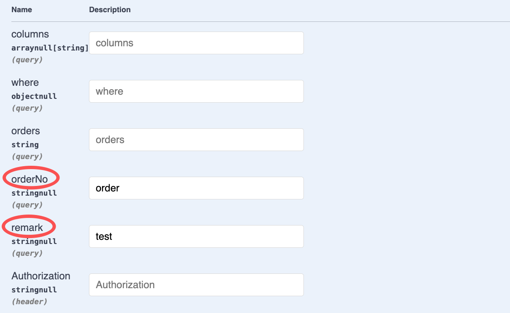
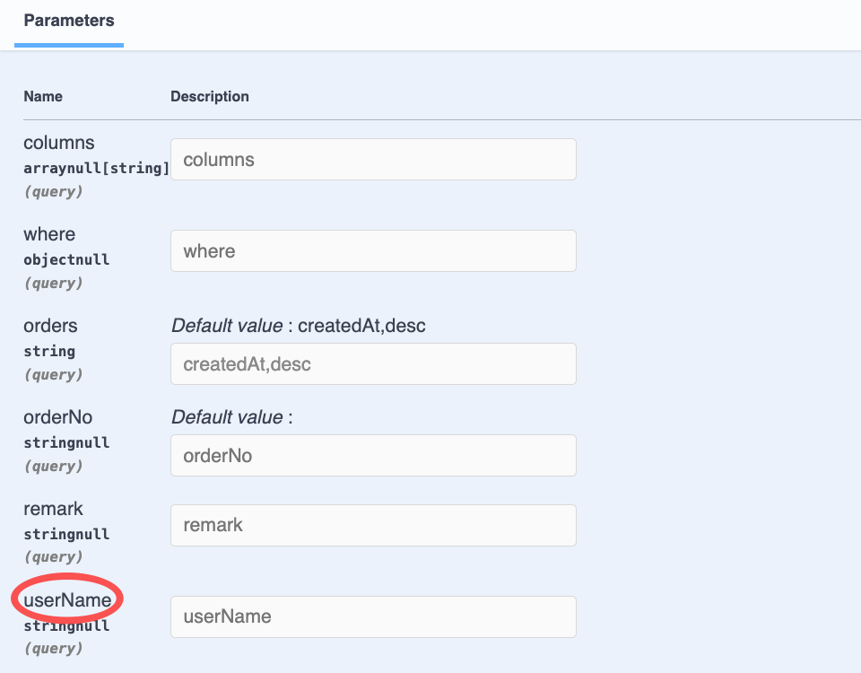

# $Dto.query/DtoQueryBase

`$Dto.query/DtoQueryBase`用于标注 Query 参数

## DtoQueryBase的用法

### 1. 创建DTO

在 VSCode 中，可以通过右键菜单`Vona Create/Dto`创建 DTO 的代码骨架：

``` typescript
@Dto()
export class DtoOrderQuery {}
```

### 2. 继承DtoQueryBase

``` typescript
@Dto()
export class DtoOrderQuery extends DtoQueryBase {}
```

## DtoQueryBase成员字段

由于`DtoOrderQuery`继承自`DtoQueryBase`，因此，有以下成员字段：

|名称|说明|举例|
|--|--|--|
|columns|要查询的字段清单|`*`, `id,orderNo,remark`, `["id","orderNo","remark"]`|
|where|条件语句|`{ "orderNo": { "_include_":  "order001" } }`|
|orders|排序|`orderNo,desc`, `[["orderNo", "desc"], ["createdAt", "desc"]]`|

## 标注Query参数

仍以 Controller Order 的 findAll 方法为例，标注 Query 参数：

``` diff
+ import type { IQueryParams } from 'vona-module-a-orm';
+ import { Arg } from 'vona-module-a-web';

class ControllerOrder extends BeanBase {
  @Web.get('findAll')
  @Api.body(v.array(DtoOrderResult))
  async findAll(
+   @Arg.filter(DtoOrderQuery) params: IQueryParams<ModelOrder>,
  ): Promise<DtoOrderResult[]> {
    return this.scope.model.order.select(params);
  }
}
```

- `@Arg.filter`：此 Pipe 对 Query 参数进行 transform，需要传入参数`DtoOrderQuery`
- `IQueryParams`: Pipe 对 Query 参数进行 transform 后的数据类型为`IQueryParams`，需要传入泛型参数`ModelOrder`，从而与`model.order.select`方法的参数类型相匹配

基于`DtoOrderQuery`生成的 Swagger/Openapi 效果如下：


## $Dto.query

如果需要在 DTO 中添加业务字段的查询条件，可以使用`$Dto.query`

``` diff
@Dto()
export class DtoOrderQuery
+ extends $Dto.query(EntityOrder, ['orderNo', 'remark']) {}
```

- `$Dto.query`：自动从`EntityOrder`中提取字段`orderNo/remark`，然后与`DtoQueryBase`成员字段进行合并

基于`DtoOrderQuery`生成的 Swagger/Openapi 效果如下：



## 添加自定义字段

还可以直接在 DTO 中添加自定义字段

``` diff
@Dto()
export class DtoOrderQuery
+ extends $Dto.query(EntityOrder, ['remark']) {
+ @Api.field(v.optional())
+ orderNo?: string;
}
```

- 从`EntityOrder`中自动提取字段`remark`
- 添加自定义字段`orderNo`

## v.openapi/v.filter

我们还可以指定 Openapi 参数，从而支持更多能力

### 1. Relations

比如，Model Order 与 Model User 是`n:1`的关系，我们可以在 Query 参数中传入`userName`作为查询条件。那么，需要在 DTO 中添加`userName`字段，并且设置 Openapi 参数

``` typescript
@Dto()
export class DtoOrderQuery
  extends $Dto.query(EntityOrder, ['orderNo', 'remark']) {
  @Api.field(
    v.openapi({
      filter: {
        table: $tableName(EntityUser),
        joinType: 'innerJoin',
        joinOn: ['userId', 'testVonaUser.id'],
        originalName: 'name',
      },
    }),
    v.optional(),
  )
  userName?: string;
}
```

也可以使用`v.filter`:

``` typescript
@Dto()
export class DtoOrderQuery
  extends $Dto.query(EntityOrder, ['orderNo', 'remark']) {
  @Api.field(
    v.filter({
      table: $tableName(EntityUser),
      joinType: 'innerJoin',
      joinOn: ['userId', 'testVonaUser.id'],
      originalName: 'name',
    }),
    v.optional(),
  )
  userName?: string;
}
```

|名称|说明|
|--|--|
|table|关联表名|
|joinType|关联类型，默认为`innerJoin`|
|joinOn|关联条件|
|originalName|原始字段名|

基于`DtoOrderQuery`生成的 Swagger/Openapi 效果如下：



### 2. 基于relations的orders

当 Model Order 与 Model User 进行联合查询时，`orders`中的字段如果在两个数据表中都存在，那么就必须明确指定表名前缀。比如：`testVonaOrder.createdAt,desc`

Vona ORM 内置了基于 relations 的 orders 处理逻辑，只需要在 DTO 中设置 Openapi 参数即可：

``` diff
@Dto<IDtoOptionsOrderQuery>({
+ openapi: {
+   filter: {
+     table: $tableName(EntityOrder),
+   },
+ },
})
export class DtoOrderQuery
  extends $Dto.query(EntityOrder, ['orderNo', 'remark']) {
  @Api.field(
    v.filter({
      table: $tableName(EntityUser),
      joinType: 'innerJoin',
      joinOn: ['userId', 'testVonaUser.id'],
      originalName: 'name',
    }),
    v.optional(),
  )
  userName?: string;
}
```
