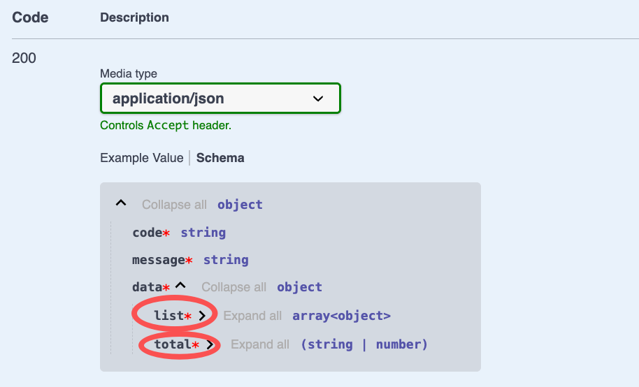

# $Dto.selectAndCount

`$Dto.selectAndCount`用于标注带分页的返回结果

## 如何使用

`$Dto.selectAndCount`的使用方式可以参考`$Dto.get`。不同的是，`$Dto.selectAndCount`返回`当前页的条目列表`和`数据总条数`

### 1. 创建DTO

在 VSCode 中，可以通过右键菜单`Vona Create/Dto`创建 DTO 的代码骨架：

``` typescript
@Dto()
export class DtoOrderResultPage {}
```

### 2. 继承$Dto.selectAndCount

``` diff
@Dto()
export class DtoOrderResultPage
+ extends $Dto.selectAndCount(() => ModelOrder) {}
```

## DtoOrderResultPage成员字段

|名称|说明|
|--|--|
|list|当前页的条目列表|
|total|数据总条数|

## 标注API返回值

以 Controller Order 的 findMany 方法为例，标注 API 返回值：

``` diff
class ControllerOrder extends BeanBase {
  @Web.get('findMany')
+ @Api.body(DtoOrderResultPage)
  async findMany(
    @Arg.queryPro(DtoOrderQueryPage) params: IQueryParams<ModelOrder>,
+ ): Promise<DtoOrderResultPage> {
    return this.scope.model.order.selectAndCount(params);
  }
}
```

- `@Api.body`：传入 DtoOrderResultPage，用于标注 API 返回值

基于`DtoOrderResultPage`生成的 Swagger/Openapi 效果如下：


