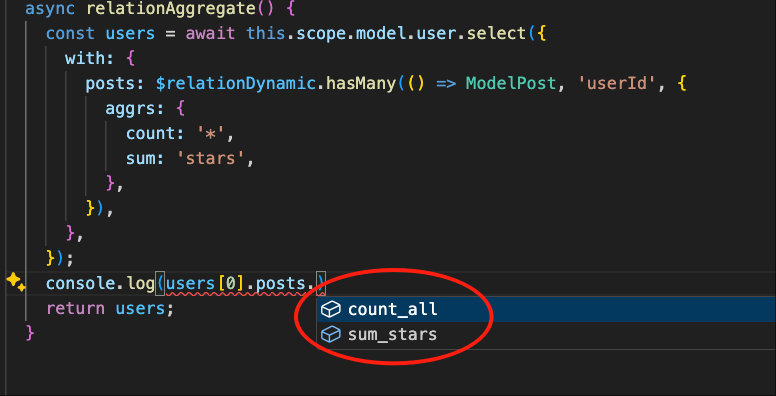

# 基于关系的聚合

下面以模块`test-vona`为例，讲解`基于关系的聚合`的用法

比如，Model User 和 Model Post 是`1:n`的关系。当我们在查询 User 数据时，可以基于关系查询相应 Post 的聚合数据

## 动态关系

``` typescript
class ServiceUser {
  async relationAggregate() {
    const users = await this.scope.model.user.select({
      with: {
        posts: $relationDynamic.hasMany(() => ModelPost, 'userId', {
          aggrs: {
            count: '*',
            sum: 'stars',
          },
        }),
      },
    });
    return users;
  }
}  
```

Vona ORM 自动推断出`users`的类型




|名称|说明|
|--|--|
|with.posts|关系名|
|$relationDynamic.hasMany|定义`1:n`关系|
|ModelPost|目标Model|
|'userId'|外键|
|aggrs|需要聚合的函数和字段。函数：`count`/`sum`/`avg`/`min`/`max`。字段：`string`/`string[]` |

## 静态关系

### 1. 定义关系

为了演示起见，新建一个 Model UserStats，定义一个静态关系`posts`

``` typescript
@Model({
  entity: EntityUser,
  relations: {
    posts: $relation.hasMany(() => ModelPost, 'userId', {
      aggrs: {
        count: '*',
        sum: 'stars',
      },
    }),
  },
})
class ModelUserStats {}
```

### 2. 使用关系


## autoload