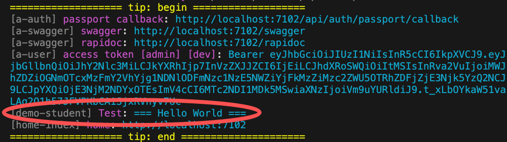

# PrintTip

VonaJS 在系统启动时在控制台`统一`输出提示信息。如下图所示：
 


可以通过`PrintTip`添加自定义的提示信息

## 创建meta.printTip

比如，在模块 demo-student 中创建`meta.printTip`。在系统启动时在控制台输出`=== Hello World ===`

### 1. Cli命令

``` bash
$ vona :create:bean meta printTip --module=demo-student
```

### 2. 菜单命令

::: tip
右键菜单 - [模块路径]: `Vona Meta/Print Tip`
:::

## meta.printTip定义

``` typescript
@Meta()
export class MetaPrintTip extends BeanBase implements IMetaPrintTipExecute {
  async execute(): Promise<TypeMetaPrintTipResult> {
    return {
      title: 'Test',
      message: '=== Hello World ===',
    };
  }
}
```

- `execute`: 返回需要输出的提示信息，支持数组类型

如下图所示：
 

